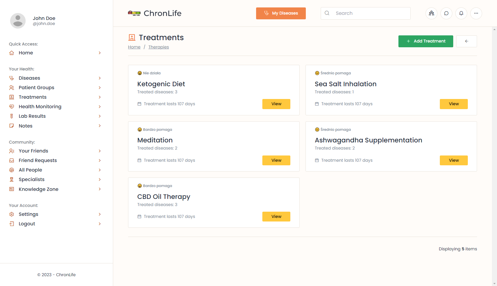
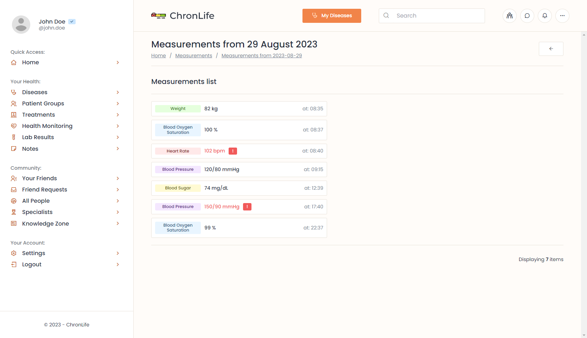
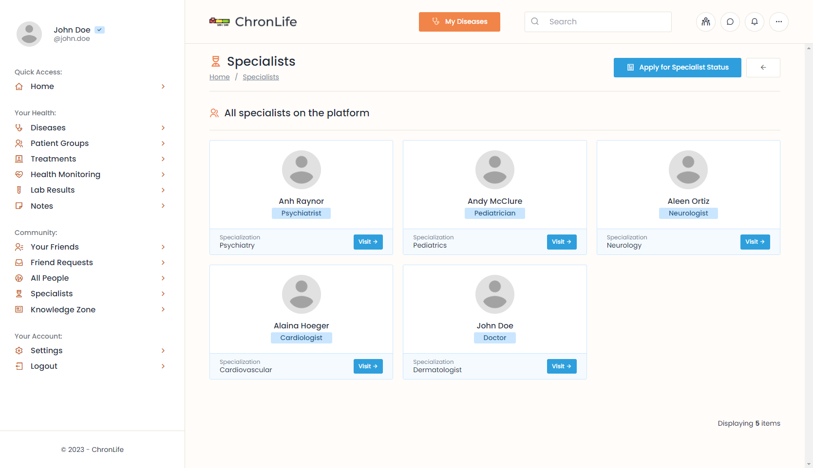

# ChronLife

This repository contains my full-stack side project, which is a social platform for people with chronic diseases.

Technologies used in this project:

<p>
  
  
  
  
  
  
</p>


## What is this project about?

The idea of this project, is to provide very simple and user friendly platform, where users can manage their chronic diseases, share their experiences with other people, find new friends and support each other.

Checkout the screenshots from the application with detailed explanations below for more details.


## Getting started

1. Install the following dependencies:
- **Ruby** `3.2.0` (I'm using [chruby](https://github.com/postmodern/chruby))
- **NodeJS** `18.16.1` (I recommend using [nvm](https://github.com/nvm-sh/nvm))
- **Yarn** (`npm i --global yarn`)
- **Docker** ([Ubuntu setup](https://docs.docker.com/engine/install/ubuntu/))

2. Create `.env` file in the root directory and fill it with the necessary data. You can use `.env.example` as a template. To setup ActiveRecord encryption, you can use the following command:

```bash
bin/rails db:encryption:init
```

3. Setup docker containers for local development:

```bash
docker-compose up -d
```

4. Finally, execute the following commands:

```bash
# Install dependencies
bundle install

# Setup the Rails application:
./bin/setup

# Run the application:
./bin/dev
```

## Design

I've came up with the design of this application by myself. I am not using any tools like Figma to create UI. I'm just creating the design on the fly. While working by myself, [I really like this approach](https://world.hey.com/dhh/design-for-the-web-without-figma-4bc3a218).

95% of SCSS code is also written by myself. I am not using any predefined templates, themes, blocks, utilities or component libraries, besides a few [Stimulus Components](https://www.stimulus-components.com/) or [Quill Editor](https://quilljs.com/).

Maybe I'm weird, but I enjoy getting my hands dirty with CSS.

## Hotwire (Turbo + Stimulus)

This application is my first take on **Turbo** (I've used **Stimulus** before, so it's not that big deal).

I haven't used the Turbo features in the whole project, but only in a few places, where the application required **eager-loaded frames** or some **interactivity**, like the comments section and reactions for disease statuses, friend requests, some of the forms and flash messages.

## RSpec

Right now, there are only [model specs](https://github.com/maciejb2k/chronlife/tree/main/spec/models) (`393 examples, 0 failures`), but I'm planning to add system specs in the future.

## I18n

This application is **I18n-ready**, offering full translation support for both **Polish** and **English** languages.

If you want to change the locale of the application, you can do it by changing the `I18n.locale` value in the `config/initializers/locale.rb` file. Remember to reset and seed the database again after changing the locale, if you want to see the data in the new language.

## Application overview

Below is a list of features that I've already implemented or I'm planning to implement in the future.

### Auth
- [x] Users authentication using Devise
- [x] Confirming account, resetting password
- [x] Omniauth authentication with Google
- [x] 2FA authentication
- [ ] Sing in using backup codes


### Dashboard
- [x] Showing feed from friends
- [x] Showing common statistics


### Diseases
- [x] Users can add disease from the list of predefined diseases


### Disease Panel
- [x] Users have access to the disease panel, where they can manage their disease statuses, symptoms, risk factors, therapies and photos


#### Disease Statuses
- [x] Users can share short updates about their disease and related well-being


### Disease Statuses - Comments and Likes
- [x] Friends and group members can comment and like disease statuses
- [x] Comments and likes features are implemented using Hotwire


#### Disease Symptoms
- [x] Users can add disease symptoms with updates of their severity in time
- [x] Users can add predefined symptoms
- [x] Users can add their own symptoms


#### Disease Risk Factors
- [x] Users can add disease risk factors, with the intensity of their influence on the disease


#### Disease Treatments
- [x] Users can add disease treatments
- [x] Multiple diseases can be assigned to the same treatment
- [x] Users can post updates about the effectiveness of the treatment with simple statuses




#### Disease Photos
- [x] Users can add photos related to their diseases


### Groups
- [x] Users can only join groups related to their diseases
- [x] When users join a group, they can see all of the disease statuses, symptoms, risk factors, therapies and photos from all of the users with the same disease. This way, users can compare their disease statuses, symptoms, therapies, etc. with other people.


#### Group Posts
- [x] Users can share posts in groups about anything related to their disease


#### Group Disease Statuses
- [x] All of the disease statuses from all of the users with the same disease are aggregated in one place


#### Group Disease Symptoms
- [x] All of the disease symptoms from all of the users with the same disease are aggregated in one place
- [x] There are simple statistics about predefined symptoms assigned to the disease by all of the users


#### Group Disease Risk Factors
- [x] All of the disease risk factors from all of the users with the same disease are aggregated in one place


#### Group Disease Treatments
- [x] All of the disease treatments from all of the users with the same disease are aggregated in one place


#### Group Disease Photos
- [x] All of the disease photos from all of the users with the same disease are aggregated in one place


### Measurements
- [x] Users can easily add common measurements like blood pressure, blood sugar, weight, etc.
- [x] Users can track their measurements in time
- [x] Users can easily view all health measurements from a specific day using the calendar view.





### Notes
- [x] Users can add simple notes
- [x] Users can pin or unpin notes
- [x] Users can add tags to notes


### Account
- [x] Users can view their or others accounts


### All users
- [x] Users can look for other users
- [ ] Users can search for other users


### Friends
- [x] Users can send friend requests to other users


### Specialists
- [x] Users can submit a request for a specialist role, which will grant them a special status on the platform and enable them to write articles.
- [x] Specialist requests are verified by the administrators, which can accept or reject the request.




### Articles
- [x] Specialists can write articles on the platform
- [ ] Articles can be filtered by tags
- [ ] Articles can be commented and liked by users


### Settings
- [x] Users can change their personal data
- [x] Users can upload their avatar
- [x] Users can enable two factor authentication
- [ ] Users can change their password when signed in


## ERD Diagram

Below is the current ERD diagram of the application.


## TODO

### Important
- [x] Add models specs
- [ ] Add system specs
- [ ] Add authorization using Pundit policies
- [ ] Fix query performance issues (n+1, etc.)
- [ ] Fix all Rubocop errors
- [ ] Complete the seeder
- [ ] Fix roles and permissions
- [ ] Add caching
- [ ] Add mailers
- [ ] Add background jobs

### Less important, but also important
- [x] Add controller translations
- [x] Add models translations
- [x] Refactor controllers
- [x] Add views translations
- [ ] Refactor routes
- [ ] Refactor ugly if statements
- [ ] Move from importmaps to `jsbundling-rails`
- [ ] Add RWD

## Final thoughts

**Working on large side projects is incredibly time-consuming**, and I didn't anticipate it to be to this extent. I'm pleased that I managed to complete the basic version of the project, as seen in the screenshots, in nearly 1.5 months. **It's physically impossible to write such a substantial amount of code within a limited timeframe on my own**.

**One of the most time consuming parts of this project was the design and writing CSS**. My goal was to create a simple and user friendly design from scratch without using any predefined templates, themes, blocks, utilities or component libraries.

Even though there are still a lot of things to do, **I'm proud of what I've accomplished so far**. I've learned a lot of new things, and I'm sure that I will learn even more while working on this project in the future.
