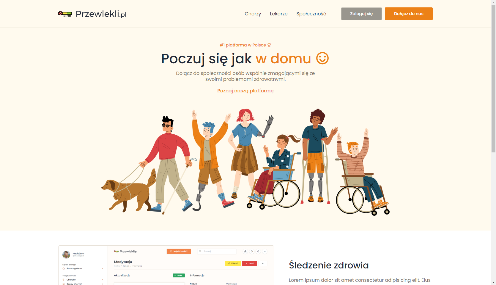
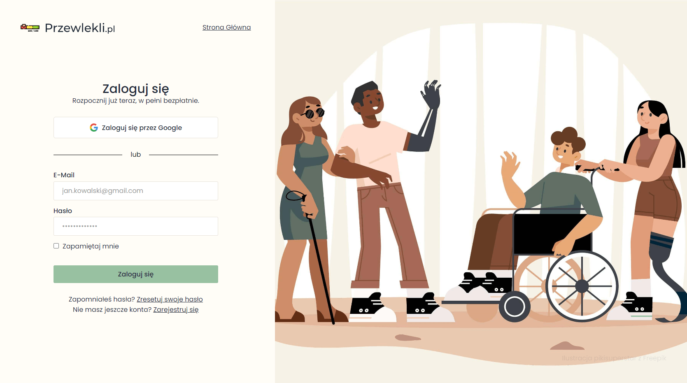

# ChronLife

This repository contains my full-stack project, which is a social platform for people with chronic diseases.

The purpose of this project is to learn how to build a full-stack applications using Ruby on Rails and it's my final year project for my bachelor's degree in the Computer Science.

**NOTICE**: This project is currently available only in the Polish language due to university requirements (the code is in English, no worries), but I18n is already configured, only the translation files are missing. I will add the translations in the future.

Technologies used in this project:

<p>
  
  
  
  
  
  
</p>



## What is this project about?

The idea of this project, is to provide very simple and user friendly platform, where users can manage their chronic diseases, share their experiences with other people, find new friends and support each other.

The platform provides advanced features for managing chronic diseases, like:
- managing disease statuses
- managing disease symptoms with updates of their severity in time
- managing disease risk factors
- managing disease therapies with updates of their effectiveness in time
- managing disease photos
- managing disease notes
- managing common measurements like blood pressure, blood sugar, weight, etc.
- managing results from medical tests
- users with the same disease can join groups dedicated to their disease, so all of the informations above from all of the users with the same disease are aggregated in one place, so users can compare their disease statuses, symptoms, therapies, etc. with other people

Checkout the screenshots from the application with detailed explanations below for more details.

## Getting started

1. Install the following dependencies:
- **Ruby** `3.2.0` (I'm using [chruby](https://github.com/postmodern/chruby))
- **NodeJS** `18.16.1` (I recommend using [nvm](https://github.com/nvm-sh/nvm))
- **Yarn** (`npm i --global yarn`)
- **Docker** ([Ubuntu setup](https://docs.docker.com/engine/install/ubuntu/))

2. Create `.env` file in the root directory and fill it with the necessary data. You can use `.env.example` as a template. To setup ActiveRecord encryption, you can use the following command:

```bash
bin/rails db:encryption:init
```

3. Setup docker containers for local development:

```bash
docker-compose up -d
```

4. Finally, execute the following commands:

```bash
# Install dependencies
bundle install

# Setup the Rails application:
./bin/setup

# Run the application:
./bin/dev
```

## Design

I've came up with the design of this application by myself. I am not using any tools like Figma to create UI. I'm just creating the design on the fly. While working by myself, [I really like this approach](https://world.hey.com/dhh/design-for-the-web-without-figma-4bc3a218).

95% of SCSS code is also written by myself. I am not using any predefined templates, themes, blocks, utilities or component libraries, besides a few [Stimulus Components](https://www.stimulus-components.com/).

Maybe I'm weird, but I enjoy getting my hands dirty with CSS.

## Hotwire (Turbo + Stimulus)

This application is my first take on Turbo (I've used Stimulus before, so it's not that big deal). I haven't used the Turbo features in the whole project, but only in a few places, where the application required some interactivity, like the comments section and reactions for disease statuses, friend requests, some of the forms and flash messages.

## Features

Below is a list of features that I've already implemented or I'm planning to implement in the future.

### Auth
- [x] Users authentication using Devise
- [x] Confirming account, resetting password
- [x] Omniauth authentication with Google
- [x] 2FA authentication
- [ ] Sing in using backup codes





### Dashboard


### Diseases


#### Disease Statuses


#### Disease Symptoms


#### Disease Risk Factors


#### Disease Treatments


#### Disease Photos


### Groups


#### Group Posts


#### Group Disease Statuses


#### Group Disease Symptoms


#### Group Disease Risk Factors


#### Group Disease Treatments


#### Group Disease Photos


### Measurements


### Notes


### Articles


### Specialists


### Settings


